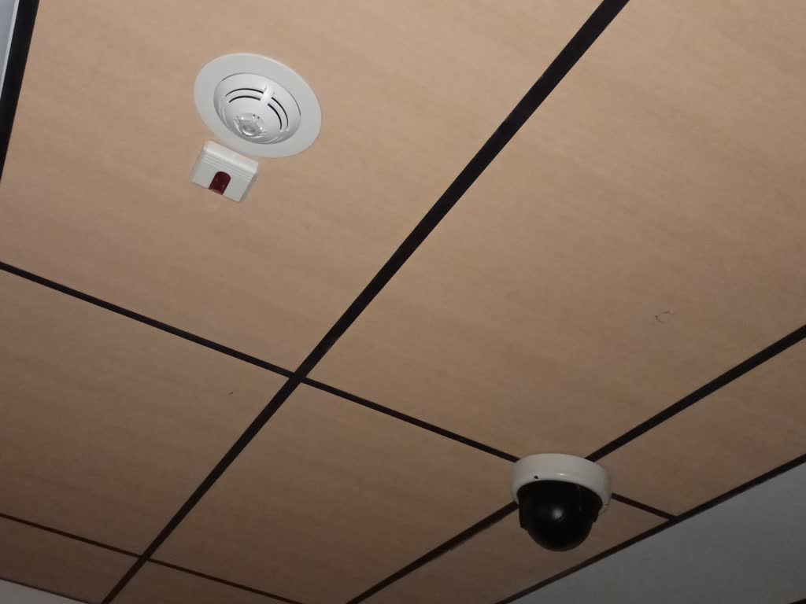
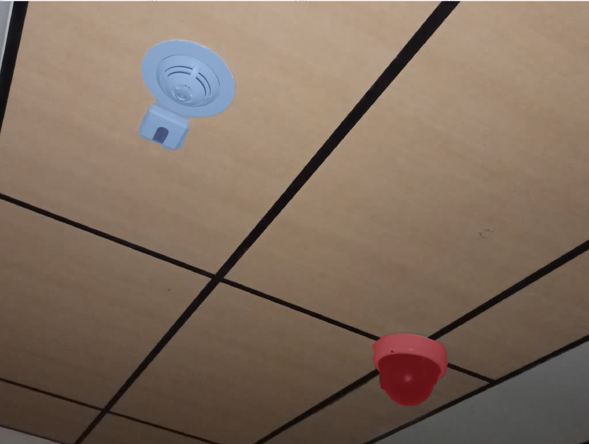
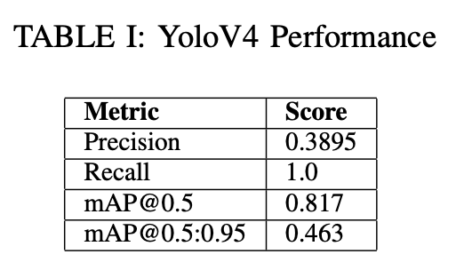
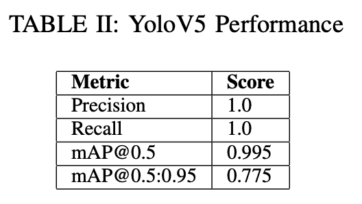
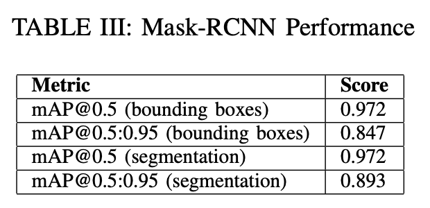
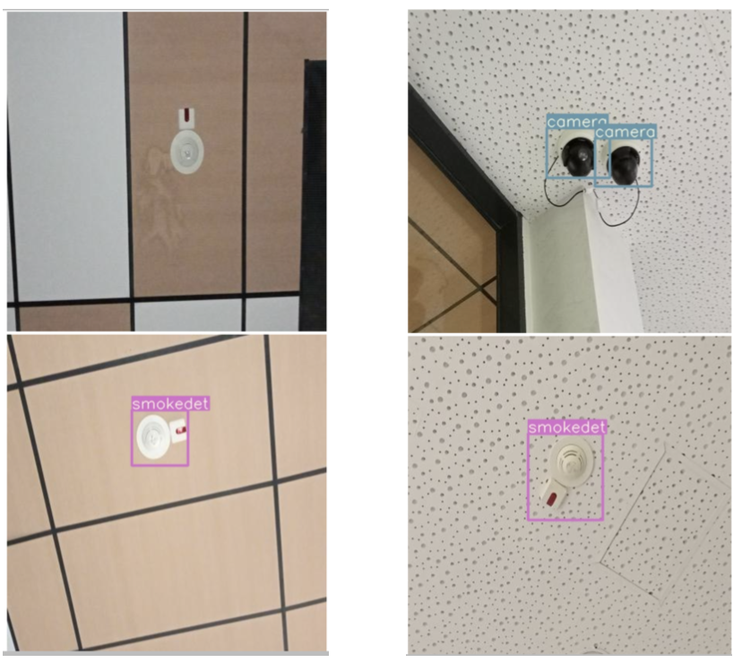
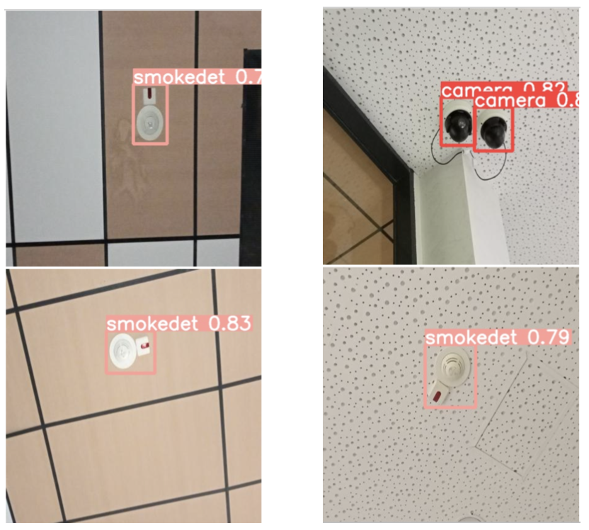
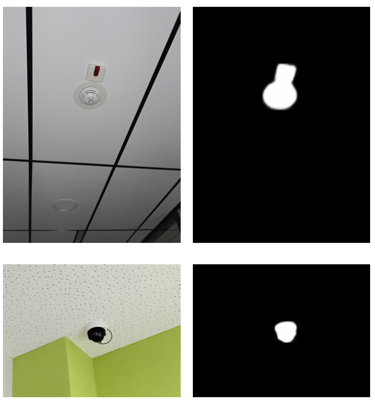

# CV&DL Object Detection

This repository contains solutions to HW2 of the CVDL course at Innopolis University.

## Colab Links

* [YoloV4](https://drive.google.com/file/d/1tS6RkL7OuoAac4d1hir--sstyHNdjje4/view?usp=sharing)

* [YoloV5](https://drive.google.com/file/d/16ljl74QxZz0fzeHqYcS1fMrVNaYMqtPL/view?usp=sharing)

* [MaskRCNN](https://drive.google.com/file/d/11I56dfjydMSNanVT6_-2VezoA2XyP3iW/view?usp=sharing)

## Why we need this?

Initially, I had an idea of creating an automatic tool for detection blind zones for cameras and smoke detectors. For this purpose an automatic detection of them should be implemented. After the detection other methods can be applied to acquired images to determine rotations and visibility zones.

## Data and dataset

The dataset consists of 168 images containing cameras and smoke detectors. The dataset was split into 3 parts: 144 images in training set, 16 in validation and 8 in test sets. You can see an example of the image below. 

### Data Acquisition 

The data was gathered using built-in camera on realme C25s phone inside the main building of Innopolis University. Most of the images were taken with flash since most of the places had relatively bad light conditions. Then all the photos were downscaled from 4000×3000pxs to the width of 1024pxs. However, the data were collected twice and the first time it was done the pictures did not have enough quality. Also the objects on those images were very small and almost impossible to recognize even for a human being.

### Object Detection Labeling Process

Before passing the acquired images to the models I needed to label all the images manually. For this purposes, a web application for data annotation Supervisely was used. After labeling objects and instances the result dataset was put into Roboflow software in order to convert Supervisely format to YoloV4 and YoloV5 specific formats. Additionally, Roboflow provides an instrument for an easy in-code dataset downloading, which was used for training too. Instance seg- mentation dataset was not converted to any specific format, a custom dataset in PyTorch was created in order to read it. Examples of labeled data are provided below. 

## Training Process

All of the models were trained on Yandex.DataSphere ma- chines with GPU NVidia Tesla V100 accelerators. 

### YoloV4

Scaled YoloV4 model was trained for 100 epochs with batch size 16 on the gathered dataset rescaled to 416x416. The training pipeline was taken from the Roboflow tutorial.

### YoloV5

Small YoloV5 model was trained for 100 epochs with batch size 16 and provided pretrained weights on the gathered dataset rescaled to 416x416. The training pipeline was taken from the Roboflow tutorial.

### Mask-RCNN

Mask-RCNN (with YoloV4 backbone) model was trained for 10 epochs with batch size 2 and provided pretrained weights from PyTorch on the gathered dataset rescaled to 416x416. The training pipeline was taken from the torchvision tutorial.

## Results

Despite the fact that the size of the dataset was small all the models showed relatively good results. The worst model in terms of mAP metric was YoloV4. There were an example of image in the test set for which the model was not able to detect any of the object. The quality of bounding boxes are also not so good. The segmentation model was good even in predicting bounding boxes, the results are comparable with YoloV5s results. Those two models showed very good results even on small dataset.

You can see inference examples below.

YoloV4 and  YoloV5 inference.

Mask-RCNN inference.

All of the model performed well on the acquired dataset. The problem is that the quality of the dataset may be very high comparing to real-life examples. Also the fact that all of the images were taken on one device is not promising, however it is solvable with adding perturbations and augmentations to the images. Overall, in general I can say that I achieved the expected results.

## Conclusion

In general, I am very satisfied with this result. I believe that yolo-like models are very powerful and almost anyone now is capable of training very simple object detection or instance segmentation model. I continue with this project in the future.